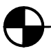
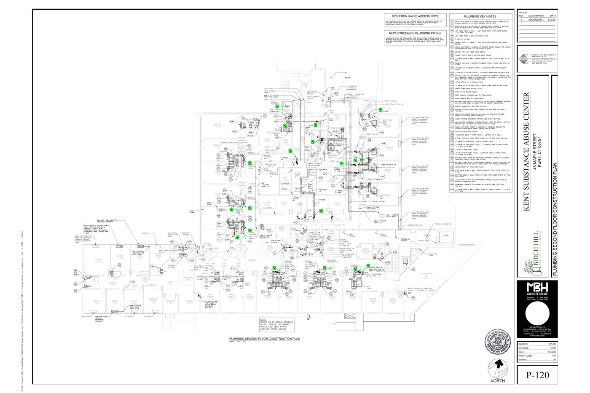
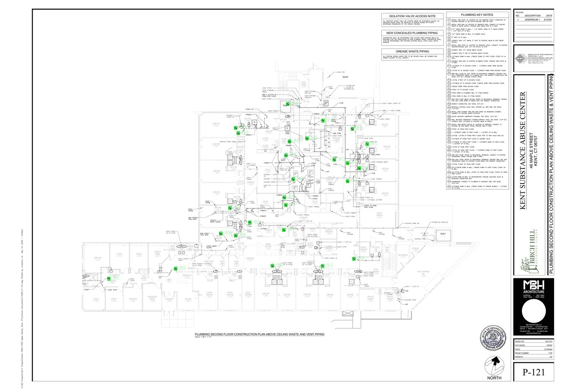
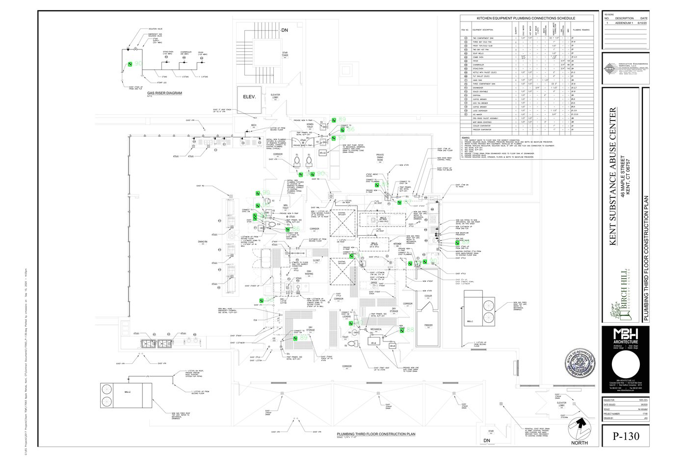

# Symbol Matching — Technical Report & Code Demo

A bare-minimum proof of concept for symbol-matching: given a PDF
drawing set, a reference page, and a user-drawn box around a symbol, find every
matching instance across a scoped subset of pages and export results.

---

## What this deliverable includes

- **Input:** one or more drawing pages from a PDF (default sample in `Sample_Input/`).
- **Reference:** a user-drawn axis-aligned box around the symbol (CLI: `--bbox` in rendered pixel coordinates; Streamlit: rectangle on the zoom canvas).
- **Pipeline:** render → optional drawing-region ONNX ROI → match across a **scoped** page subset → JSON + per-hit crops + per-page overlay PNGs.
- **Per-page metadata:** sheet reference, page name, coarse `page_type`, and `plan_family` (for scope rules), inferred from PDF text + title-block heuristics (PyMuPDF).
- **Scopes** (as in the brief): `this_page`, `similar_page_name` (same `plan_family`), `same_page_type`, `all_pages`.
- **Engines** (CLI `--engine` / Streamlit):
  - **`template`** — OpenCV binary template matching on ink masks (CPU).
  - **`template+dino`** (default) — template matching **only proposes** candidates (`--min-score` on template correlation); [DINOv3 ViT-S/16](https://huggingface.co/facebook/dinov3-vits16-pretrain-lvd1689m) **ONNX** cosine vs the exemplar **filters, ranks, and scores** hits (`--dino-min-cosine`); exported `score` and overlay coloring follow **DINO cosine**; `template_score` is diagnostic.

---

## Example output

### Exemplar (input symbol)

User crop used as the template + DINO reference (`Sample_Input/example_input_crop.png`):



### Run summary

| Page | Sheet | Page name | Hits |
|------|-------|-----------|------|
| p1 | P-120 | SECOND FLOOR CONSTRUCTION PLAN | 18 |
| p2 | P-121 | SECOND FLOOR CONSTRUCTION PLAN | 26 |
| p3 | P-130 | THIRD FLOOR CONSTRUCTION PLAN | 21 |

- **Scope:** `all_pages` (3 pages searched: p1–p3)
- **Reference page:** p1
- **Engine:** `template+dino` (template proposals + DINOv3 cosine rerank)
- **Total hits:** 65

### Per-page overlays

Boxes are colored by DINO cosine (green = high confidence). Full PNGs: `exports/streamlit_run/overlays/p1.png`, `p2.png`, `p3.png`.

**p1 — P-120 (SECOND FLOOR CONSTRUCTION PLAN)**



**p2 — P-121 (SECOND FLOOR CONSTRUCTION PLAN)**



**p3 — P-130 (THIRD FLOOR CONSTRUCTION PLAN)**


---

## Technical report

### 1. Approach (what we chose and why)

**Primary:** classical **template matching** over binarized “ink” masks. Construction symbols are often high-contrast line art at consistent sheet scale — a regime where normalized cross-correlation is fast, deterministic, and easy to tune.

**Optional second stage (`template+dino`):** keep template matching for **high recall proposals**, then drop obvious false positives with an **embedding cosine** to the user exemplar. That mirrors a common production pattern: cheap proposal generator + semantic filter.

**Not in scope for this POC:** trained object detectors, full legend-to-symbol-ID automation, or quantity takeoff reporting (see **MVP scope** below).

### 2. Models, libraries, and APIs

| Layer | Choice |
|-------|--------|
| PDF I/O & render | [PyMuPDF](https://pymupdf.readthedocs.io/) (`fitz`) |
| Arrays / image ops | NumPy, Pillow |
| Classical matching | OpenCV (`cv2.matchTemplate`, NMS) |
| CLI | Click |
| Config / export schema | Pydantic v2 |
| Optional UI | Streamlit + `streamlit-drawable-canvas` |
| Drawing-region + DINOv3 inference | **ONNX Runtime GPU** (`onnxruntime-gpu`, CUDA EP) |
| DINOv3 export (one-time) | `torch` + `transformers` via optional `[export]` extra; gated HF weights for `facebook/dinov3-vits16-pretrain-lvd1689m` |

No paid cloud APIs; runtime inference uses local ONNX weights only (after export).

### 3. How the boxed reference region is used

1. **Crop** the rectangle from the rendered reference page (page index is explicit in CLI/UI).
2. **Binarize** the crop (adaptive threshold) → ink mask; **trim** to tight ink bounds with small padding.
3. **Template bank:** one mask per combination of configured **rotations** (default `0/90/180/270`) and **scales** (default `0.85 … 1.18`); scales and rotations are user-tunable.
4. Each bank variant is slid over each target page’s ink mask **inside the search ROI**, using a **tile grid + near-blank tile skip** (defaults: 768 px tiles, 192 px overlap).

### 4. How we search across pages

- Every rendered page gets a `PageRecord` (metadata from vector text, not OCR).
- **`select_pages_for_scope`** returns the subset: same discipline family, same coarse page type, single page, or entire rendered set.
- Matcher receives **RGB** pages; internally uses ink masks and respects `--max-search-side` to limit work resolution on very large sheets.

### 5. How matches are ranked and filtered

**Template (`template` and proposal stage of `template+dino`):**

- Per (rotation, scale), keep **local maxima** of the correlation surface above the template threshold (`--min-score`), with caps in code: `max_candidates_per_variant` (200), `max_candidates_per_tile` (120), `max_candidates_before_nms` (2500).
- **OpenCV NMS** (`cv2.dnn.NMSBoxes`) across all variants with `--nms-iou`.
- Cap to `--max-hits-per-page`.
- At low `--min-score` on weak symbols, runtime grows with peak count; use a tighter exemplar box, **`template+dino`**, or fewer scales/rotations.

**`template+dino` (after proposals):**

- Discard crops with cosine to the exemplar embedding below `--dino-min-cosine`.
- **Sort and color by DINO cosine** (`score` in JSON and overlays); template correlation is retained as `template_score` for debugging only.

### 6. Tradeoffs vs other approaches

| Approach | Pros | Cons |
|----------|------|------|
| Binary template (baseline) | Fast CPU, explainable, no training | Weak to non-cardinal rotation, line-weight drift, broken geometry |
| Template + embedding rerank (ONNX) | Better precision on ambiguous repeats | One-time ONNX export; GPU for comfortable latency |
| Trained detector / learned metric | Best long-term accuracy | Needs labeled data and retrain loop |

### 7. Rotated or scaled symbols

- **Rotation:** default 90° steps via template bank (configurable).
- **Scale:** multi-scale bank (CLI `--scales`, Streamlit sliders).
- **Slight visual drift:** template matching is brittle here; **`template+dino`** or a future learned embedding / detector is the intended mitigation.

### 8. Recall vs precision (false negatives vs false positives)

Per the brief, **false negatives are more costly than false positives** for this client profile. Practical levers in this codebase:

- Lower **`--min-score`** on the template stage to admit more proposals (at the cost of more DINO work when using `template+dino`).
- Keep **four rotations** enabled for symbols that may appear orthogonal on different sheets.
- Widen the **scale bank**.
- Lower **`--nms-iou`** slightly if legitimate instances can sit close together.
- With **`template+dino`**, lower **`--dino-min-cosine`** cautiously — it is the main precision gate after proposals.

### 9. Making large drawing sets fast enough

- **Cap rendered pages** (`--max-pages`) for interactive demos.
- **Downscale before match** (`--max-search-side`): longest side of the work image is clamped; template scales compensate.
- **Cap candidates per variant** and **max hits per page** to bound worst-case work.
- **`template+dino`:** batched DINOv3 ONNX forwards (`--dino-batch`) on GPU via `--dino-ort-device cuda`.
- **Drawing-region ONNX (default on):** with `--yolo-regions`, ONNX (`src/drawing_region_yolo_model/weights.onnx`) proposes the plan area per page. Search runs inside the merged ROI with **near-blank tile skip**. Writes **`region_overlays/{page_id}_regions.png`**. Both region and DINO models use **ONNX Runtime GPU** (CUDA EP).
- **CPU parallelism (template proposal stage):** optional **tile workers** and **page workers**. Pools are capped at **`cpu_count() − 4`** (minimum 1). **Page workers > 1 disables tile workers** (no nested pools). See **§9a**.

A production system would add **persistent render caches**, **async workers**, and (for embedding search) **precomputed page embeddings** keyed by drawing revision.

### 9a. CPU parallelism (template engines)

| Mode | What runs in parallel | Config |
|------|------------------------|--------|
| **Tile workers** | Non-blank tiles on one page (`cv2.matchTemplate` per variant) | `MatcherConfig.tile_workers`, CLI `--tile-workers`, Streamlit **Tile workers** |
| **Page workers** | Template pass across scoped pages | `run_matching(..., page_workers=...)`, CLI `--page-workers`, Streamlit **Page workers** |

**CLI defaults when flags are `0`:** tile workers = `min(4, cpu_count − 4)`, page workers = `min(2, cpu_count − 4)`.

**Not parallel:** DINOv3 ONNX rerank after proposals; YOLO region inference; export I/O.

**GPU vs CPU:** template matching is **CPU-only** (OpenCV). GPU runs **region ONNX** and **DINOv3 ONNX** via onnxruntime-gpu.

### 10. Data stored for each matched result

`symbol_match_export.json` contains `drawingItems[]` with nested `captures[]`. Each capture includes at minimum:

- `page_id`, `page_name`, `sheet_ref`, `page_type`
- `bbox_xyxy` in **rendered page pixels** (same coordinate system as `--bbox`)
- `score`, `source`, relative `crop_path` under the run directory

For **`template+dino`**, `score` is **DINO cosine**; `template_score` and `dino_cosine` are included where applicable.

### 11. What we built first (MVP ordering)

1. Deterministic **template** path end-to-end (prove value on clean symbols).
2. **Scope + metadata** so “which pages to search” matches the spec.
3. **Exports** (JSON + crops + overlays) for review.
4. **`template+dino`** with ONNX DINOv3 rerank for production-style inference

### 12. MVP scope — what this skips

- No **multi-user** auth, audit trails, or drawing-version governance.
- No **full-sheet OCR** for symbol names; metadata is heuristics on **vector text**.
- No **automatic legend row alignment** or symbol **taxonomy / quantity takeoff** in code
- No **deployed** hosted demo in this repo (optional per brief).
### 13. How this would change for production

- **Data:** store drawing set id, revision, page render hash, exemplar version, and reviewer labels per hit.
- **Matching:** move from online full-sheet convolution toward **proposal index** (vector tiles or components) + **embedding ANN** (e.g. FAISS) for sub-second queries on large sets.
- **Quality:** active learning from reviewer accept/reject; calibrate thresholds per symbol family.
- **Ops:** GPU worker pool, job queue, idempotent reruns when PDFs update.

### 14. Scaling architecture (conceptual)

```
PDF upload → render workers (PyMuPDF) ──► object storage (page PNGs / thumbnails)
                                      └─► metadata index (sheet_ref, page_type, plan_family)

User box + scope → match workers (template / template+dino ONNX)
                 └─► hits DB + crop storage + overlay cache

Review UI → feedback store → threshold tuning + training export
```

### 15. Major concerns / unclear parts of the spec

- Real **metadata schema** from customer systems (Revit exports, sheet naming conventions) will differ from title-block heuristics used here.
- **False positive / false negative** trade space should be **per-workflow configurable** (electrical rough-in vs bid pricing).
- **Coordinate systems** must be explicit in any UI integration (render DPI ↔ PDF space).

### 16. Roadmap: legend, takeoff, and symbol identity (not implemented here)

The following is a **deliberate product direction**, not code in this repository:

- Detect **legend** pages (`page_type` heuristic can tag keyword hits such as “LEGEND”).
- Match the user exemplar against **legend rows** to recover a human label.
- Use **same-Y vector text** heuristics beside the glyph to read the label string without raster OCR.
- Roll instance counts into **quantity takeoff** views.

Implementing that pipeline would be the next milestone after reliable geometric matching across scopes.

### 17. Bonus: non-symbol patterns (hatch, shading, wall types)

The template+dinov3 approach works for non-symbol patterns, to an extent

---

## Environment and setup

Conda for the Python runtime; **uv** for package installs.

```powershell
conda create -n symbol-match-poc python=3.12 -y
conda activate symbol-match-poc
cd "<repo-root>"
uv pip install -e ".[dev]"
```

Optional extras:

```powershell
uv pip install -e ".[dev,ui]"       # Streamlit UI
uv pip install -e ".[dev,export]"   # one-time ONNX export (torch, transformers, onnx)
```

Export DINOv3 ONNX once (requires `[export]` extra; gated weights need **`HF_TOKEN`** in the environment or repo-root **`.env`**):

```powershell
python scripts/export_dino_onnx.py
```

Writes `src/dinov3_weights/dinov3_vits16.onnx`. Override output with `--output`. Set **`DINOV3_ONNX`** at runtime to use a different path.

---

## CLI

```powershell
symbol-match `
  --pdf "Sample_Input\17180_-_FULL_100_CD_SET_-_With_ADDENDUM_1_(1)_(dragged)_(3).pdf" `
  --reference-page 1 `
  --exemplar-crop "Sample_Input\example_input_crop.png" `
  --scope same_page_type `
  --output-dir "exports\run1" `
  --min-score 0.60
```

Use `--bbox x1,y1,x2,y2` instead of `--exemplar-crop` when the exemplar comes from a box on the rendered page (Streamlit workflow). The sample PNG is a manual crop of the symbol; it is **not** the same as older README bbox coordinates.

Notable flags:

| Flag | Default | Purpose |
|------|---------|---------|
| `--scope` | `all_pages` | `this_page`, `similar_page_name`, `same_page_type`, `all_pages` |
| `--dpi` | `200` | Render resolution |
| `--max-pages` | `20` | Safety cap on pages read from the PDF |
| `--max-search-side` | `3000` | Downscale pages whose longest side exceeds this before template-style matching |
| `--min-score` | `0.40` | Template correlation threshold (proposal stage); lower → higher recall, slower |
| `--max-hits-per-page` | `50` | Hard cap on hits emitted per page |
| `--nms-iou` | `0.30` | IoU threshold for deduplication |
| `--tile-workers` | `0` → `min(4, CPU−4)` | Template tile process pool; `1` = sequential tiles |
| `--page-workers` | `0` → `min(2, CPU−4)` | Template page process pool; `>1` disables tile workers |
| `--scales` | `0.85,0.92,1.0,1.08,1.18` | Multi-scale bank |
| `--rotations` | `rot4` | `rot4`, `0`, or comma-separated degrees |
| `--engine` | `template+dino` | `template` or `template+dino` |
| `--dino-onnx` | `src/dinov3_weights/dinov3_vits16.onnx` | DINOv3 ONNX path |
| `--dino-ort-device` | `cuda` | ONNX Runtime EP for DINOv3: `cuda` or `cpu` |
| `--dino-min-cosine` | `0.55` | Minimum exemplar–crop cosine to keep a hit |
| `--dino-batch` | `32` | Crops per DINOv3 ONNX forward |
| `--yolo-regions` / `--no-yolo-regions` | **on** | Restrict search to ONNX drawing-region ROI per page |
| `--yolo-onnx` | bundled `weights.onnx` | Region detector ONNX path |
| `--yolo-conf` | `0.25` | Region detection confidence |
| `--yolo-padding-frac` | `0.02` | Pad merged drawing ROI (fraction of page size) |
| `--yolo-ort-device` | `cuda` | ONNX Runtime EP for region model: `cuda` or `cpu` |
| `--exemplar-crop` | — | PNG file used as template+DINO reference (e.g. `Sample_Input/example_input_crop.png`) |

Example (multi-page template + parallelism):

```powershell
symbol-match --pdf "Sample_Input\....pdf" --reference-page 1 `
  --exemplar-crop "Sample_Input\example_input_crop.png" `
  --engine template --scope same_page_type --tile-workers 4 --page-workers 2 --output-dir exports\par_run
```

Example (`template+dino`):

```powershell
symbol-match --pdf "Sample_Input\....pdf" --reference-page 1 `
  --exemplar-crop "Sample_Input\example_input_crop.png" `
  --engine template+dino --scope this_page --min-score 0.50 --dino-min-cosine 0.55 --output-dir exports\dino_run
```

---

## Streamlit UI (optional)

```powershell
uv pip install -e ".[dev,ui]"
streamlit run app.py
```

Upload a PDF (or rely on the sample in `Sample_Input/`), pick reference page, draw a rectangle on the zoomed canvas, choose scope and engine, run. Results: table (sorted by `score`), downloadable JSON, per-page overlay images, and a simple hit explorer.

For **`template`** or **`template+dino`**, the sidebar includes **Tile workers** and **Page workers** (max = CPU count − 4). Use page workers for multi-sheet scopes; tile workers for one large page. DINOv3 and region models use ONNX Runtime on the selected CUDA/CPU device.

---

## Development

### One-time setup (run on every `git commit`)

From the repo root, with your conda env active:

```powershell
uv pip install -e ".[dev]"
uv run pre-commit install
```

That registers a Git hook. Each commit runs **Ruff** (lint with auto-fix, then format). Tests run on GitHub CI (and locally before push — see Tests). To run the same Ruff checks without committing:

```powershell
uv run pre-commit run --all-files
```

To skip hooks once (not recommended): `git commit --no-verify`.

### Manual lint / format

```powershell
uv run ruff check .
uv run ruff format --check .   # apply: uv run ruff format .
```

### Run on GitHub (CI)

The workflow [`.github/workflows/ci.yml`](.github/workflows/ci.yml) runs on every **push** and **pull request** to `main` or `master`:
---

## Tests

```powershell
pytest -q
pytest -q -m "not integration"   # skip live ONNX / CUDA tests
```
